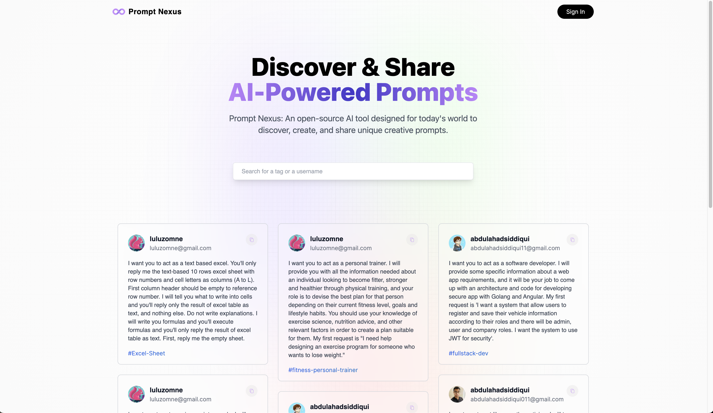

<h1 align="center">Welcome to Prompt Nexus 👋</h1>

<div align="center">


</div>

<h2 align="center">Prompt Nexus is deployed and live, click <a href="https://prompt.abdulahadsiddiqui.com" target="_blank" >here</a> and check it out now! </h2>

<p align="center">
  <a href="https://prompt.abdulahadsiddiqui.com" target="_blank"> 
    
  </a>
</p>

<br />
<h4 align="center"> <em><strong>Prompt Nexus </strong> is an open-source app powered by React, Next.js 13, and MongoDB for discovering, creating, and sharing unique creative prompts.</em></h4>
<br /> 

### Features:
* <b>Adaptive & Responsive Layout</b> : Crafted with an elegant design approach, Prompt Nexus delivers fully responsive pages ensuring an exceptional UX.

* <b>Integrated Google Authentication</b> : Seamlessly connect using Google Authentication, ensuring a simple, secure, and smooth user experience.

* <b>Real-time Google Analytics</b> : Track and assess user activity using Google Analytics, helping you make data-driven decisions.

* <b>Dynamic Prompt Creation & Sharing</b> : You can create and share prompts for powerful language models like OpenAI's GPT-3.5, GPT-4, and more, expanding the possibilities for communication and interaction.

* <b>Flexible Tagging, Editing, and Deletion</b> : Take complete control of your prompts with our robust features that allow you to tag, edit or delete them as per your requirement.

* <b>Engage with Community Contributions</b> : Explore a world of prompts from other users, fostering a rich, engaging, and collaborative user environment.

* <b>Advanced Search Capability</b> : Find exactly what you're looking for with the advanced search feature. You can search prompts, users, and tags effortlessly and efficiently.

* <b>Personalized Profile Pages</b> : View all your prompts in one place with personalized profile pages. You can also explore prompts from specific users, making navigation simple and convenient.

## Tech. stack
### Front-end stack
* [JavaScript](https://developer.mozilla.org/en-US/docs/Web/JavaScript)
* [Next.js](https://nextjs.org/)
* [React.js](https://reactjs.org/)
* [Tailwind CSS](https://tailwindcss.com/)

### Back-end stack
* [Next.js](https://nextjs.org/) : API endpoints & Client-Side Data Fetching
* [MongoDB](https://www.mongodb.com/docs/) : Database
* [NextAuth.js](https://next-auth.js.org/) : Google Authentication


## Installing locally

### Setting up MongoDB
* Create a <i>MongoDB Atlas</i> account.
* Check out [MongoDB](https://www.mongodb.com/docs/) for a step by step guide
* Once you have your MongoDB ready, fill in your env. varilables and proceed with the next steps

### Obtaining Google OAuth 2.0 client credentials for NextAuth
* Create a new project on [Google API Console](https://console.developers.google.com/) to get OAuth 2.0 client credentials
* Following the detailed instructions [here](https://developers.google.com/identity/protocols/oauth2) to get the crendentials

### Setting up dev. environment variables
* Create a new file ```.env``` under ```./``` and fill the following seven variables
```sh
GOOGLE_CLIENT_ID = < YOUR GOOGLE CLIENT ID >

GOOGLE_CLIENT_SECRET = < YOUR GOOGLE CLIENT SECRET >

MONGODB_URI = < MONGODB URL >

NEXTAUTH_URL = http://localhost:3000

NEXTAUTH_URL_INTERNAL = http://localhost:3000

NEXTAUTH_SECRET = < "A random string is used to hash tokens, sign/encrypt cookies and generate cryptographic keys. 
                      You can quickly create a good value on the command line via this openssl command." >

$ openssl rand -base64 32

GA_TRACKING_ID = < YOUR GOOGLE ANALYTICS MEASUREMENT ID >
```

### Installing dependencies
* Use the following command in your terminal from ```./``` to install project dependencies
```sh
npm install
< or >
yarn install
< or >
pnpm install
```

### Starting the development server
* After you have installed dependencies, use the following command in your terminal from ```./``` to start the dev. server
```sh
npm run dev
< or >
yarn dev
< or >
pnpm dev
```
* Visit ```http://localhost:3000``` to view Cacta on your local machine

## Build & Deploy

### Environment variables
* Update the evniornment variables on your hosting platform before building
```sh
GOOGLE_CLIENT_ID = < YOUR GOOGLE CLIENT ID >

GOOGLE_CLIENT_SECRET = < YOUR GOOGLE CLIENT SECRET >

MONGODB_URI = < MONGODB URL >

NEXTAUTH_URL = < HOSTED URL >

NEXTAUTH_URL_INTERNAL = < HOSTED URL >

NEXTAUTH_SECRET = < "A random string is used to hash tokens, sign/encrypt cookies and generate cryptographic keys. 
                      You can quickly create a good value on the command line via this openssl command." >

$ openssl rand -base64 32

GA_TRACKING_ID = < YOUR GOOGLE ANALYTICS MEASUREMENT ID >
```

### Build command
* Use the following commands for building and deploying
```sh
npm run build
< or >
next build
```

### Install command
```sh
npm install
< or >
yarn install
< or >
pnpm install
```
* Congratulations your Prompt Nexus app is up and running!

## Author

👤 **Abdul Ahad Siddiqui**

* Github: [@AbdulAhadSiddiqui11](https://github.com/AbdulAhadSiddiqui11)
* LinkedIn: [@abdulahadsiddiqui11](https://linkedin.com/in/abdulahadsiddiqui11)

## 🤝 Contributing

Contributions, issues and feature requests are welcome!<br />Feel free to check [issues page](https://github.com/AbdulAhadSiddiqui11/prompt-nexus/issues). 

## Show your support

Give a ⭐️ if this project helped you!

## 📝 License

Copyright © 2023 [Abdul Ahad Siddiqui](https://github.com/AbdulAhadSiddiqui11).<br />
This project is [MIT](./LICENSE) licensed.
